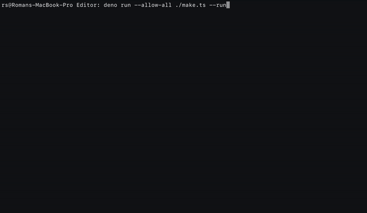

### What is it?

Clang based build system, for C/C++ projects, that you can leverage using TypeScript and Deno.

- Parallel compilation;
- Object files caching;
- Nice console output;

### Usage

```typescript
// make.ts

import * as Path from 'https://deno.land/std/path/mod.ts';
import { Target, tempPath } from 'https://deno.land/x/buildsystem/mod.ts';

const temp: string = Path.join(tempPath(), 'MyApp');
const library: string = Path.resolve('path/to/library');
const project: string = Path.resolve(Deno.cwd());

if (Deno.args.includes('--clean')
|| Deno.args.includes('--release')) {
    try {
        Deno.removeSync(temp, { recursive: true });
    } catch (e) {}
}

const target = new Target();
target.sources = [`${library}/path/to/file1.c`,
                `${library}/path/to/file2.c`,
                `${library}/path/to/file3.c`,
                `${project}/Source/file1.c`,
                `${project}/Source/file2.c`,
                `${project}/Source/main.c`];
target.output = Path.join(temp, 'MyApp.out');
target.includeSearch = [library];
target.frameworks = ['Cocoa', 'Metal', 'MetalKit', 'QuartzCore'];
target.arguments = ['-Wall'];
target.macros = ['__METAL__'];
target.objcARC = true;

if (Deno.args.includes('--release')) {
    target.debug = false;
    target.oLevel = 3;
} else {
    target.debug = true;
}

const res = await target.make({ output: true, threads: 16 });

if (res.type === 'complete')
    if (Deno.args.includes('--run'))
        await Deno.run({ cmd: [ target.output ] }).status();
```

```shell
deno run --allow-all ./make.ts --run
```

### Status

Unstable alpha version.